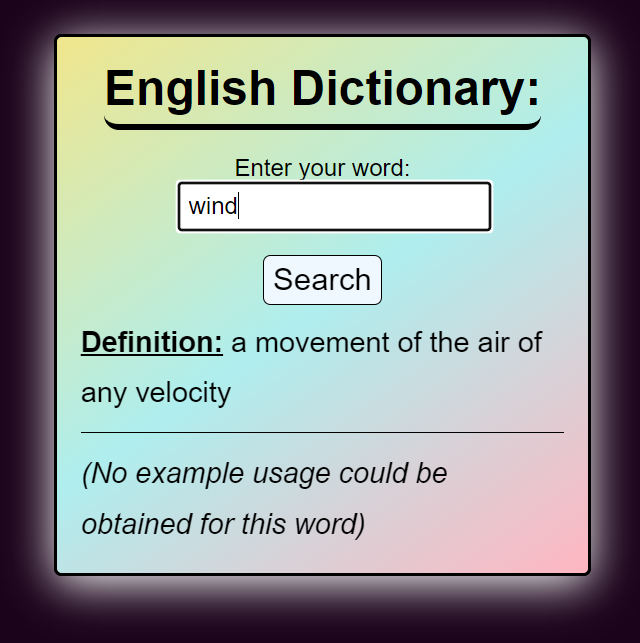

# Dictionary App

**Table Of Contents**

- [Author](#author)
- [Introduction](#introduction)
- [Installation](#installation)
- [Launching the Application](#launch)
- [Caution](#caution)

## Author

<a href="https://github.com/HenriBranken" target="_blank">Henri Branken</a>

## Introduction

This is a simple **React App** that will display the definition and example usage of any word typed in by the user.

This project used the Merriam Webster Dictionary API: [https://www.dictionaryapi.com](https://www.dictionaryapi.com), and is also dependent on an API Key. In particular, we use the following endpoint to retrieve data about a word: `https://www.dictionaryapi.com/api/v3/references/sd4/json/${enteredWord}?key=${API_KEY}`

You will notice that the `API_KEY` is hard-coded into the `App.js` file.

The main feature here is to create a React App that interacts with a third-party API to fetch data.

## Installation

- `cd` into the React project folder containing the `packages.json` file.
- From the command line interface, execute `npm install`. This should create a `node_modules` folder in the project directory.

## Launching the Application

- In the project directory, execute `npm start` from the command line. This should by default spin up a browser tab at [https://localhost:3000](https://localhost:3000).
- From here, you should be able to interact with the Dictionary UI.
  - Type your desired word into the input field, and press Enter.

## Caution

It is possible for an entered word not to exist in the Dictionary Databases. It is therefore normal to encounter messages which state the `<word> does not exist in this dictionary.` In the same vein, it is not a given that an example usage exists for every word. In such a case, you will encounter: `No example usage could be obtained for this word`.
